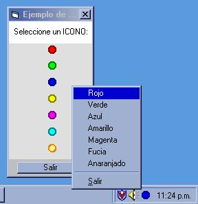



## SystemTray Control

### Description

This is a activex control to help you with the system tray icons handling. I've never seen another like this. It's very easy to use, and i show some great stuff!!

This is a really old project, but it´s useful! It has 5 mouse events as follows:

* click

* dblclick

* mousedown

* mousemove

* mouseup

It never was too easy!!
 
### More Info
 

----

USE ONLY A CONTROL ON A FORM !!!!!!!!!!

             |
---                |---
**Submitted On**   |2002-03-07 00:13:44
**By**             |[Ivan Garavito](https://github.com/Planet-Source-Code/PSCIndex/blob/master/ByAuthor/ivan-garavito.md)
**Level**          |Advanced
**User Rating**    |4.0 (8 globes from 2 users)
**Compatibility**  |VB 6\.0
**Category**       |[Miscellaneous](https://github.com/Planet-Source-Code/PSCIndex/blob/master/ByCategory/miscellaneous__1-1.md)
**World**          |[Visual Basic](https://github.com/Planet-Source-Code/PSCIndex/blob/master/ByWorld/visual-basic.md)
**Archive File**   |[SystemTray60016372002\.zip](https://github.com/Planet-Source-Code/ivan-garavito-systemtray-control__1-32423/archive/master.zip)

